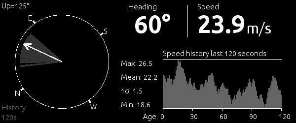

# DASHBOARD

Simple class for calculating statistics and displaying wind data.

## System
Python 2.7.6

### Pillow
http://pillow.readthedocs.org

If you are running Ubuntu upgrade to the latest version  
<code>pip install --upgrade Pillow</code>

### NumPy
http://www.numpy.org/

## Fonts
Fonts used are from the Ubuntu Font Family: 
http://font.ubuntu.com/licence/
